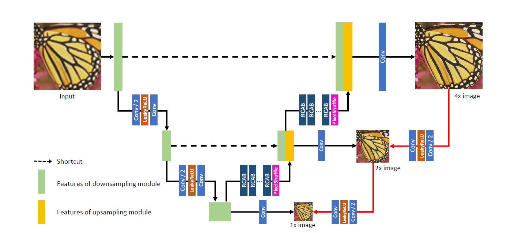

## Closed-loop Matters: Dual Regression Networks for Single Image Super-Resolution  

<p align="center">

</p>  

&emsp; Paper: [link](https://arxiv.org/pdf/2003.07018.pdf )  
&emsp; Official Implementation (pytorch): [link](https://github.com/guoyongcs/DRN)  

## results

This model is train on DIV2K_train_HR(800 images) with 300 epochs(per epoch 50 iterations) , and not use dual regression. This code supports dual regression. You can try to use more data and train more epochs. I think it will perform better.

|                        | Set5 paper(matlab) | Set5 this(tensorflow) |
| ---------------------- | :----------------: | :-------------------: |
| **Algorithms**         |  **PSNR / SSIM**   |    **PSNR / SSIM**    |
| **Bicubic_x4**         |   28.42 / 0.810    |     26.69 / 0.773     |
| **DRN-S_x4**           |   32.53 / -        |     27.91 / 0.854     |
| **DRN-S_x4**(Dual reg) |   32.68 / 0.901    |     28.09 / 0.855     |

**use tf.image.psnr/tf.image.ssim to calculate PSNR/SSIM is different from matlab(paper). It seems that there is always a gap between the results calculated by Python and MATLAB.**  

<p align="center">

</p>  

## train  
**Refer to train.ipynb for training**  
```python
def DRN(input_shape=(64,64,3),model='DRN-S',scale=4,nColor=3,training=True,dual=True):
    """
    input_shape: input image's shape
    model: support DRN-S and DRN-L
    scale: support x4 and x8
    nColor: output image's channels
    training: True or False, return inference model or train model
    dual: Dual regression, support True and False
    """ 
```
## inference
**Refer to inference.ipynb for inference**

```python
from inference import Inference

# init model
weights_path = 'pretrain_models/model.h5'
input_size = 64
scale = 4
infernce = Inference(weights_path, input_size, scale)
```

```python
# start inference
name = 'img_test/img1_'
lr_path = name+'LR'+'.png'
sr_path = name+'SR'+'.png'
infernce(lr_path, sr_path)
```
